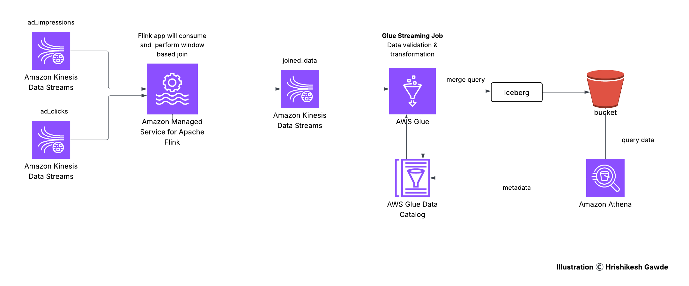

# Ad Tech Real Time Data Analysis

## Introduction
This project focuses on real-time ad analytics by integrating modern cloud-native tools and event-driven processing with Apache Flink. It ingests streaming ad impression and click data from Kinesis, performs event-time joins using PyFlink on AWS Managed Flink, enriches the data via AWS Glue Spark Streaming, and stores the output in Iceberg tables on S3. Athena is used for querying the processed data. This pipeline demonstrates an end-to-end real-time data processing and analytics solution using a modern, scalable tech stack.

## Problem Statement
In the digital advertising ecosystem, real-time analysis of user interactions like ad impressions and ad clicks is essential for optimizing campaigns and revenue. Traditional batch pipelines often fall short in delivering timely insights. This project addresses the need for a robust, scalable, and real-time data processing solution.

## Architecture
The architecture involves real-time ingestion through Amazon Kinesis, processing using AWS Managed Flink and Glue Streaming, and analytical storage and querying using Apache Iceberg, S3, and Athena.
 

## Technology Used
- Python
- Apache Flink (PyFlink with Table API)
- AWS Kinesis Data Streams
- AWS Managed Service for Apache Flink
- AWS Glue (Spark Streaming)
- Apache Iceberg
- Amazon S3
- AWS Glue Catalog
- Amazon Athena
- Maven

## Dataset Used
#### Input Data
- `ad_impressions`: ad_id, impression_id, campaign_id, publisher_id, event_time, device_type, geo_location, platform, ad_type, bid_price
- `ad_clicks`: ad_id, impression_id, campaign_id, publisher_id, event_time, device_type, geo_location, platform, click_price

#### Output Stream
- joined_output: Contains records generated by joining ad_impressions and ad_clicks on impression_id within a time window.

## Scripts for Project
- main.py: PyFlink application that reads from ad_impressions and ad_clicks, performs a time-windowed join using Table API, and writes results to joined_output.
- mock_data_gen.py: Generates and sends mock data into the Kinesis input streams.
- glue_post_processing_streaming_job.py: Glue streaming job that processes joined_output, applies business logic, and writes the final data to an Apache Iceberg table.

## Output and Impact
#### Derived Columns
- is_premium_ad
- engagement_duration
- platform_category
- click_revenue
- processed_time

#### Business Impact
The derived metrics provide valuable business insights that enhance ad performance evaluation and campaign strategy. `is_premium_ad` helps identify high-value ads, enabling better budget allocation. `engagement_duration` measures user interest, supporting content optimization. `platform_category` segments traffic sources for more targeted advertising. `click_revenue` directly ties user actions to revenue, aiding ROI analysis. `processed_time` ensures data freshness, supporting timely decision-making and performance tracking.

## My Learnings
- Hands-on experience with PyFlink and AWS Managed Flink deployment
- Implementing event-time stream joins with watermarks
- Real-time data modeling using Apache Iceberg
- Writing Glue streaming jobs for post-processing and enrichment
- Designing a scalable, end-to-end, real-time analytics pipeline in the cloud
